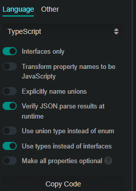

# AstroJS

## Características

### Islas

Son bloques dinámicos dentro de una arquitectura estática, es decir, que cargan JavaScript.

### Framework agnóstico

Astro se puede utilizar con múltiples bibliotecas frontend como React, Vue, Svelte, Vanilla, s sin bibliotecas.

## Primeros pasos

Instalación --> `pnpm create astro@latest`
Extensión VsCode --> Astro oficial

## Sistema de archivos

astro.config.mjs --> Configuración de astro --> Por ejemplo añadir integraciones ()

src/env.d.ts --> Archivo de typing de Astro

### Layouts

Componente que envuelve partes de la app, funcionan como plantilla.

Al contratio de next js debe declararse para envolver los demás componentes.

### Slot

Funciona similiar qué en web components o a children en react

### Slots nombrados

```js
// slot nombrado
<slot name="before"></slot>
// Utilizando el campo del slot nombrado
<span slot="before">Soy el contenido de un slot antes de este</span>
```

Los slot pueden tener contenido por defecto

```js
<slot>Texto por defecto</slot>
```

### Pages

Carpeta que tendrá los archivos que serán las rutas

## Sintáxis

Similar a JSX, pero no es la misma.

### Bloque JS

Al iniciar el archivo se delimita la isla con tres guiones arriba y abajo:

```astro
---
import Layout from '../layouts/Layout.astro'
import Card from '../components/Card.astro'
---
```

### Componentes

```js
// Crear --> Hello.Astro
---
const {name} = Astro.props
---
<h1>¡Hola, {name}!</h1>
  
// Montar --> Example.Astro
---
import Hello from "../components/Hello.astro";
---
<main>
  <Hello name="Alejandra" />
  <Hello name="Juan" />
  <p>¡Hola a todos!</p>
</main>
```

### Props

```astro
---
// para typescript
interface Props {
	title: string;
	body: string;
	href: string;
}

// typescript y js
const { href, title, body } = Astro.props;
---
```

### Estilos

Los componentes incluyen su sección de estilos.

**Scope interno** --> el estilo solo funciona para los elementos del componente.

```html
<style>
  h1 {
  color: 'green';
  }
</style>

<!-- Este estilo solo se aplicará al h1 del componente -->
```

**Scope global** --> el estilo se aplica a todos los elementos a los que aplique el selector.

```html
<style is:global>/* Directiva */
	:root {
		--accent: 136, 58, 234;
		--accent-light: 224, 204, 250;		
	}
</style>
```

**Directivas**

Instrucción adicional, ejemplo --> is:global, is:inline

### Variable global Astro

Contiene información y realiza acciones, ejemplos --> `Astro.props`, `Astro.params`

<!-- https://youtu.be/RB5tR_nqUEw?t=1564 -->

## Sistema de ingraciones

Astro tiene muchas integraciones preestablecidas, a la lista se accede con `pnpn astro add --help`

### Tailwind

`pnpm astro add tailwind`

## Primer componente

`components/Header.astro`
- Cargar en el Index el headerg

## slot

Funciona similar a un children, pero con la funcionalidad adicional de poder declararle un atributo `name` para poder utilizar más de un slot, ejemplo --> `before` `after` y así facilitar la maquetación.

```js
// Declarando slots
<a
  href={link}
>
  <slot name="before" />
  <slot>Contenido por defecto</slot>
  <slot name="after" />
</a>

// Instanciando slots

<HeaderButton link="/">
  
	<div></div> // slot 
</HeaderButton>
```

## Markdown

Astro es totalmente compatible con Markdown, son instalar nada. solo basta con crear un archivo .md es pages y ya lo carga.

### Markdown Front Matter

Espacio del documento dónde se añaden datos y metadatos sobre el documento
se declara con:
`---
 ---`

Pendiente --> Estudiar más a profundidad el tema de markdown y los blogs, sobre todo los `content collections` para definir esquemas.

```markdown
---
title: 'Contenido de la página'
Layout: '../layouts/'Layout.astro
---
```

--------> Pendiente revisar y practicar cómo se cargan layouts y componentes en md

## HTML

También es posible cargar páginas y componentes html sin instalar nada.

## Fetching de datos

Se realiza como en js, en el bloque de código js de los archivos astro.

```javascript
---
const res = await fetch("https://api.spacexdata.com/v5/launches/query")
const data = res.json()
---
```

## Tipar data para facilitar el autocompletado (typescript)

### quicktype

Herramienta para extraer los tipos desde un JSON --> [quicktype](https://quicktype.io/)



**En la web:**

Pagar el json de la data. si se obtiene por medio de la consola (console ninja) utilizar JSON stringify --> const data = `JSON.stringify(await res.json())`

No olvidar cambiar el `Name` --> Servirá para el import --> ejemplo --> `APISpaceXResponse`

**En el espacio de trabajo**

Crear archivo src/types/api.ts --> Pegar los tipos obtenidos

Importar los tipos en el componente donde se va a realizar el fetch de la api --> `import { type APISpaceXResponse } from "../types/api"`

Hacer aserción de tipos al obtener la data

```javascript
const { docs } = (await res.json()) as APISpaceXResponse
```

#### Truco JS

Se puede cambiar el nombre de un objeto cuándo se accede por medio de destructuring

`const { docs: launches } = (await res.json()) as APISpaceXResponse`


## Iterar elementos

Se puede usar `map` en los elementos, dentro de `{}` similar a JSX, pero no necesita establecer la `key`

```javascript
<div>
  {
    launches.map(
      ({ id, links, details, flight_number: flightNumber, success }) => (
        <CardLaunch
          id={id}
          img={links.patch.small}
          details={details}
          flightNumber={flightNumber}
          success={success}
        />
      ),
    )
  }
</div>
```

## Renderizado condicional

<!-- https://youtu.be/RB5tR_nqUEw -->